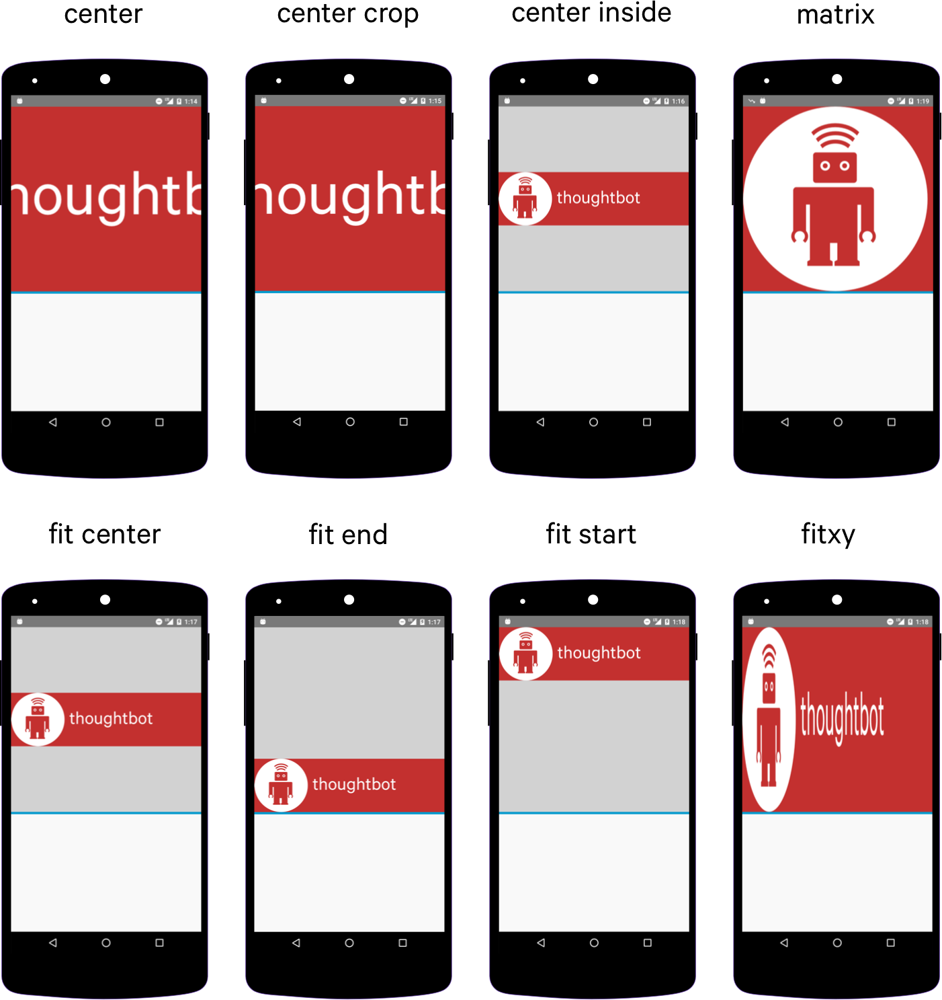

# ImageView ScaleType的解释

## ImageView中各种ScaleType的定义和解释

1. CENTER_CROP

   Scale the image uniformly (maintain the image’s aspect ratio) so that both dimensions (width and height) of the image will be equal to or larger than the corresponding dimension of the view (minus padding). The image is then centered in the view. From XML, use this syntax: 

   ```xml
   android:scaleType="centerCrop"
   ```

   维持图片的宽高比不变地缩放，使得经过缩放后的图片的宽和高都要 >= 控件减掉padding后的宽和高。即：图片小了会等比例放大，但是图片大了，不知道是否会等比例缩小？

2. CENTER_INSIDE

   Scale the image uniformly (maintain the image’s aspect ratio) so that both dimensions (width and height) of the image will be equal to or less than the corresponding dimension of the view (minus padding). The image is then centered in the view. From XML, use this syntax: 

   ```xml
   android:scaleType="centerInside"
   ```

   维持图片的宽高比不变地缩放，使得经过缩放后的图片的宽和高都要 <= 控件减掉padding后的宽和高。即：图片大了会等比例缩小，但是图片小了，不知道是否会等比例放大？

3. CENTER

   Center the image in the view, but perform no scaling. From XML, use this syntax: 

   ```xml
   android:scaleType="center"
   ```

   不缩放图片，仅移动图片的位置，使得图片的中心与控件中心重合

4. FIT_CENTER

   Scale the image using {@link Matrix.ScaleToFit#CENTER}. That is, Compute a scale that will maintain the original src aspect ratio, but will also ensure that src fits entirely inside dst. At least one axis (X or Y) will fit exactly. The result is centered inside dst. From XML, use this syntax:

   ```xml
   android:scaleType="fitCenter"
   ```

   维持图片的宽高比不变地缩放，使得经过缩放后的图片能刚好完全嵌入到控件内（即：经过缩放后，图片至少有一条边是刚好和控件的那条边长度相等），然后将缩放后的图片放置到控件的中心位置（即：图片和控件的中心重合）

5. FIT_START

   Scale the image using {@link Matrix.ScaleToFit#START}. That is, Compute a scale that will maintain the original src aspect ratio, but will also ensure that src fits entirely inside dst. At least one axis (X or Y) will fit exactly. START aligns the result to the left and top edges of dst. From XML, use this syntax: 

   ```xml
   android:scaleType="fitStart"
   ```

   维持图片的宽高比不变地缩放，使得经过缩放后的图片能刚好完全嵌入到控件内（即：经过缩放后，图片至少有一条边是刚好和控件的那条边长度相等），然后将缩放后的图片移动到与控件的左边和上边对齐。不确定RTL语言下的方向是否刚好相反?

6. FIT_END

   Scale the image using {@link Matrix.ScaleToFit#END}. That is, Compute a scale that will maintain the original src aspect ratio, but will also ensure that src fits entirely inside dst. At least one axis (X or Y) will fit exactly. END aligns the result to the right and bottom edges of dst.From XML, use this syntax: 

   ```xml
   android:scaleType="fitEnd"
   ```

   维持图片的宽高比不变地缩放，使得经过缩放后的图片能刚好完全嵌入到控件内（即：经过缩放后，图片至少有一条边是刚好和控件的那条边长度相等），然后将缩放后的图片移动到与控件的右边和下边对齐。不确定RTL语言下的方向是否刚好相反?

7. FIT_XY

   Scale the image using {@link Matrix.ScaleToFit#FILL}. That is, Scale in X and Y independently, so that src matches dst exactly. This may change the aspect ratio of the src. From XML, use this syntax: 

   ```xml
   android:scaleType="fitXY"
   ```

   宽高各自独立地缩放（这样可能会改变宽高比），使得经过缩放后的图片的宽高都能刚好完全嵌入到控件内（即：经过缩放后的图片的宽和高，与控件的宽和高长度都相等）

8. MATRIX

   Scale using the image matrix when drawing. The image matrix can be set using {@link ImageView#setImageMatrix(Matrix)}. From XML, use this syntax: 

   ```xml
   android:scaleType="matrix"
   ```

   ​

## 图例

