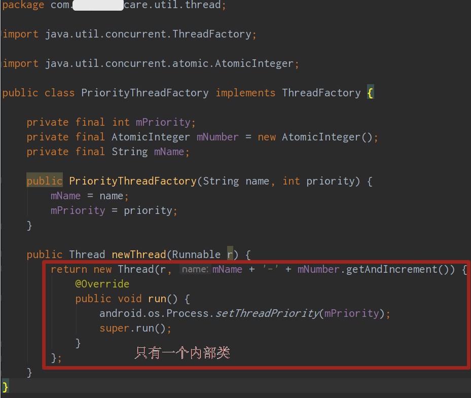
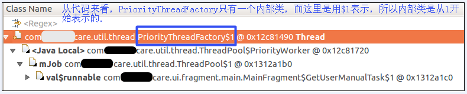
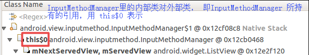

1. MAT中关于匿名内部类的命名, 以及内部类对外部类的引用各自所使用的 "\$数字" 的说明.

   - MAT中, 匿名内部类的**命名**, 因为是匿名的, 所以只能使用 "\$ 数字" 表示, 该数字是从1开始的, 不是从0开始的.  即: MAT中, 一个类中的首个内部类的**名称**是用 $1表示的. 如下图:

     代码:

     

     MAT-ShortestPathToGCRoots:

     

   - MAT中, 内部类对外部类的**引用**, 使用 "this\$0" 表示. 如下图:

     